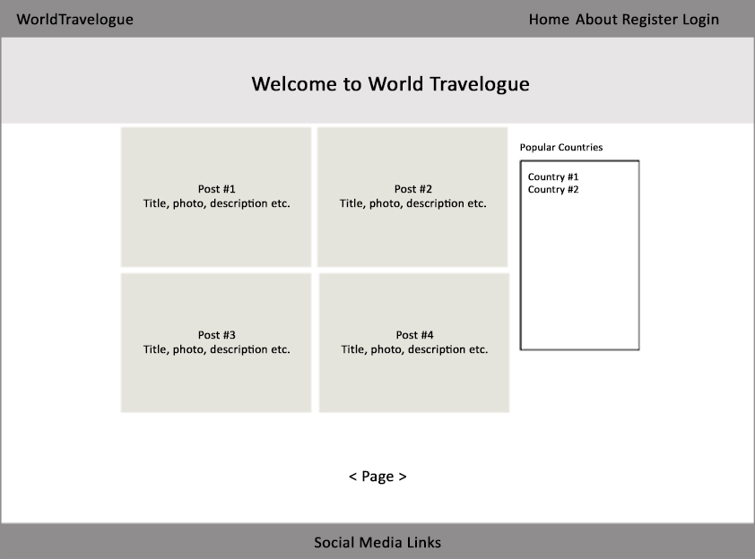
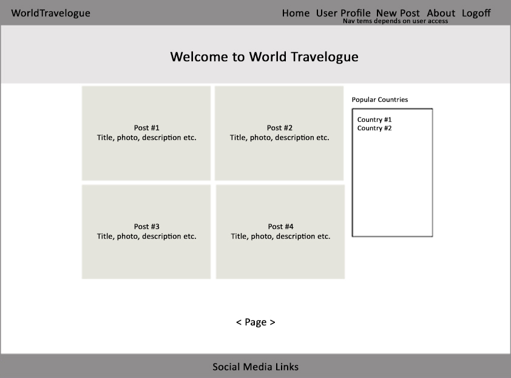

# WorldTravelogue
WorldTravelogue is a free online travel diary for travellers across the world. It works from internet cafes and computers world wide, to allow you to update an online travel diary and share your experiences, it is free to join and takes just minutes to signup.
On this site the blogs are based on the theme in Travel and is a collection of tools so that travellers can write down a journal and share it to family, friends and other travellers. Photo and link to useful sites about the areas can be added to your blog. Also, comments can be added to the blog by other users so it can help out future travellers to the area.

Click [here](https://travelogue22kw.herokuapp.com/) to access live site.

*Screenshot - Mockup on WorldTravelogue App, generated from [Multi Device Website Mockup Generator](https://techsini.com/multi-mockup/index.php)*

---

## Objectives
The main objective of this site is to provide a platform for travelers to keep a journal online and share it with families and friends as well as other travelers.

The target audients will be travelers who wants to post their journal and people who want to contribute and find out more about the travel destinations.

### Application Goals
* Create a community to share travel experiences on destinations across the world.
* A platform that allows the users to create and update their travel journal instantly and share it with families and friends.
* A platform that allows users to get information about the travel destinations by reading other people's posts.
* Administrators to control and maintain users and posts.

### User Goals
* Any users can view posts on the site.
* Signup to create posts with photos and descriptions.
* Registered users can maintain their personal posts.
* Registered users can leave comments and like posts by other users.
* Registered users can update and maintain their own account profile.

---
## Application Design

This application will be built using Bootstrap, Django and Cloudinary to store images. The final application will be deployed and running on Heroku.

### Initial Design

The following are initial wireframe designs to meet the main objective.

*Wireframe - Home Page*

*Wireframe - Example of a Home Page after signin*

*Wireframe - Post Detail Page*

### Design Approach

The development approach on this project is based on the Principles of Agile and use the common agile practices.

The design has broken down into User Stories and grouped into Epics. Each User Story has been allocated its priority, story point and set acceptance criteria and tasks. Timeboxing approach will be used to process the product backlog.

**User Stories**

There are 37 user stories identified at the beginning of the project and they were grouped into 7 Epics as listed in the table below.

**[User Stories Full Detailed Report (Click to view)](readme/user-stories/user-stories.md#user-stories)**

*Summary of Epics and User Stories*

### Process Map

The following is the process map for the site. The site can be accessed by non-registered users, registered users and administrators.

* Non-registered users have restricted access and only can view posts on the site.
* Registered users can create, read, update and delete posts. These users also have restricted access and only can manage their own posts.
* Administrators are users that have both access to the site and the control panel where they have full control to user profiles, posts and approve comments.

*Site Process Map*

___

## Project Requirements

This project has been developed using Python Django, Bootstrap and Deployed in Heroku. The following are the project requirements in order to run the application.

* Django
* Gunicorn
* dj_databases_url
* Psycopg2
* Cloudinary
* dj3_cloudinary_storage
* PostgreSQL
* Django summernote
* Django countries
* Django crispy Forms
* Django allauth
* Heroku
* Bootstrap v5.0.2
___

## Features

The aim of this site is to create a community to share travel experiences and let other potential visitors to find more information about the destinations.

In order to meet the aim and allow the community to grow. There are no restriction to visit the site but different access rights will be set to different user groups. The user groups have been defined into 3 different types for this site.

1. **Non-registered users**
    * Only allow to view posts and comments
    * Allow to register

2. **Registered users**
    * Allow to login
    * View posts, like or unlike and leave comment to other users’ posts
    * Create, Read, Update and Delete personal posts
    * View, update and delete personal account

3. **Administrators**
    * Allow to login
    * View posts, like or unlike and leave comment to other users’ posts
    * Create, Read, Update and Delete personal posts
    * View and update personal account
    * Access to control panel to perform site maintenance

This application has 2 separate sites:
* [Users site for general access - Frontend access](#frontend---header-and-footer)
* [Administrators site for maintenance - Backend access](#backend---administrator-control-panel)

### Frontend - Header and Footer

Users should be able to navigate and find information easily.

To help users to navigate and find information easily, all pages have a header with a navigation bar and a footer. The navigation bar items are depending on user access rights. Footer is where users can find the link to "Contact us" page and links to social media platform. Each social media link will be opened in a separate window.

#### Header for Non-Registered users

* Menu Items:

    * Home___About___Register___Login

#### Header for Registered Users

* Menu Items:
    * Home___New Post___User Profile___About___Logout

#### Header for Administrators

* Menu Items:
    * Home___New Post___User Profile___About___Control Panel___Logout

#### Header and Footer with Collapsed Menu Bar For Mobile Devices

### Frontend - Home Page

Users should able to view posts when they visiting this site.

When users visiting this site, they should be landed onto the home page. The home page is where all the published posts are listed and the site has set a maximum of 4 posts per page. Navigation buttons are available to select next and previous page when there are more than 4 posts.

#### Posts list in Home Page

Each Post has the following layout:

* Feature image - either a default or uploaded by the user
* Author's username
* Country that the post is related
* Post Title
* A summary description about the post
* A "Read more" button
* Date and time stamp when the post was created
* Number of likes for the post

#### Users Access Rights to Posts

Different user groups have different access rights to the posts.

#### *Access rights for Non-Registered users*

* Allow to register as a site member by clicking the "Register" from the menu bar
* Read about the site by clicking the "About" from the menu bar
* View individual post by clicking the "Read More" button from a post
* Select posts to view from popular country by clicking the country from the side widget named "Popular Countries"
* Select posts to view from a country by clicking the Country from a post
* Select posts to view from an author by clicking the Author from a post

#### *Access rights for Registered users*

* Allow to login to the site by clicking the "Login" from the menu bar
* Allow to create a new post by clicking the "New Post" from the menu bar
* Allow to view and update user profile by clicking the "User Profile" from the menu bar
* View individual post by clicking the "Read More" button from a post
* Select personal posts to view by clicking the username from the side widget named "My Posts"
* Select posts to view from popular country by clicking the country from the side widget named "Popular Countries"
* Select posts to view from a country by clicking the Country from a post
* Select posts to view from an author by clicking the Author from a post

#### *Access rights for Administrators*

* Allow to login to the site by clicking the "Login" from the menu bar
* Allow to create a new post by clicking the "New Post" from the menu bar
* Allow to view and update user profile by clicking the "User Profile" from the menu bar
* Allow to access to the control panel by clicking the "Control Panel" from the menu bar
* View individual post by clicking the "Read More" button from a post
* Select personal posts to view by clicking the username from the side widget named "My Posts"
* Select posts to view from popular country by clicking the country from the side widget named "Popular Countries"
* Select posts to view from a country by clicking the Country from a post
* Select posts to view from an author by clicking the Author from a post

#### Responsive on Mobile Devices

For mobile devices, 1 post per row and side widgets are re-arranged below the posts.

#### Filter Posts

Users should be able to view posts that is more relevant to them.

This site can narrow down the posts by offering filters to the users by Country or Author.

#### Filter By Country

Select a country from the side widget for "Popular Countries" or the country from a post. All the posts related to the selected country will return as a new list. A message will say "No Posts Found!" when there are no posts for the selected country and the side widget shows the current filter is set to the selected country. Select "All" to clear the current filter.

#### Filter By Author

Select your own posts from the side widget for "My Posts" or an author from a post. All the posts related to the selected author will return as a new list. A message will say "No Posts Found!" when there are no posts for the selected author and the side widget shows the current filter is set to the selected author. Select "All" to clear the current filter.

### Frontend - Create New Posts

Registered users should allow to create new personal posts.

When a user signed in to the site then a new post can be created by clicking "New Post" from the menu bar.

Create a New Post form is presented to the user and all the mandatory fields need to be filled in before it can be submitted.

**Create a New Post Form**

### Frontend - Post Detail

Users should able to access the detail of each post.

All users can view post in details and read comments that associated with the post. Registered users can leave comments and like/unlike posts.

Each Detail Post has the following layout:

* Inside the Banner
    * Post Title
    * Author's username | Date and time stamp when the post was created
    * Country that the post is related
* Detail Section
    * Feature image - either a default or uploaded by the user
    * Edit and Delete buttons (Post's Owner Only)
    * A summary description about the post
    * A detail description about the post
    * Number of likes for the post
    * Number of comments for the post
* Comments Section
    * A list of comments from most recent first with Author and Date stamp
    * Leave a comment form with a Submit button (Registered Users Only)

#### Users Access Rights to Post Detail

Different user groups have different access rights to the post detail.

#### *Access Rights for Non-Registered Users*

* View post details only
* View comments only

#### *Access Rights for Registered Users*

* View post details
* Leave comment to any post
* Like/Unlike any post

#### *Access Rights for Owner's Post*

* View post details
* Leave comment to any post
* Like/Unlike any post
* Edit and update personal posts
* Delete personal posts

### Frontend - Leave Comment to a Post

Registered users should able to comment any posts

A form is available in the detail post where registered users can fill in and submit the form. The comment counter goes up by 1 when a comment has submitted successfully.

**Example of leaving a comment**

In this example, the author submitted a comment "Very tasty" and it appears on the left and the system ask whether the user wish to leave another comment. Select the "Add Another Comment" takes the user back the comment form and select "Go Back" takes the user back to the home page.

### Frontend - Like/Unlike Post

Registered users should able to like/unlike any posts

The option to like or unlike a post is available in the detail post and it is in a form of a "Heart" shape.

* It should be grey out for non-registered users
* Click to toggle between like or unlike post
    * Red outline heart shape means the current user has not liked the post yet
    * Solid heart shape means current user liked the post
    * Likes counter goes up or down by 1 when toggle between like and unlike post

### Frontend - Edit Personal Post

Registered users should able to edit and update personal posts

When the registered user signed in to the site and select a personal post then the post can be updated by submitting the form.

**A Form to Edit and Update Post**

### Frontend - Delete Personal Post

Registered users should able to delete personal posts

When the registered user signed in to the site and select a personal post then the post can be deleted.

**Confirmation Message to Delete a Post**

### Frontend - User Accounts

Users should be able to create, read, update and delete their own account profile.

The site allows viewers to create an account. After signed in to the account, the owner can view, update and delete their account profile.

#### Create an Account

Select Register from the menu bar, fill and submit the form.

#### Sign in to an Account

Select Login from the menu bar,  fill and submit user details

#### Sign out from Account

Select Logout from the menu bar and confirm sign out.

#### View an Account Profile

Login and select User Profile from the menu bar

#### Update an Account Profile

Login and select User Profile from the menu bar

Edit and select Update to update profile

#### Change an Account Password

Login and select User Profile from the menu bar

Select Change Password

Fill details and submit changes

#### Delete an Account

Login and select User Profile from the menu bar

Select Delete and confirm delete account

### Frontend - About Page

Users should able to find more information about the site.

The About page offer information about the site and the user can access it by selecting "About" from the menu bar.

### Frontend - Contact us Page

Users should able to contact the site support team.

The Contact us page contains information for user to contact the support team and can be access by selecting "Contact us" in the footer.

### Frontend - Message Bar

Users should be able to confirm actions have been performed.

On this site, a message bar has been created to confirm action has been performed. Message only appears for 3 seconds when the action has been performed. Examples are Login and Logout successfully, Post and Comment added successfully.

**Message shows signed in as admin**

### Backend - Administrator Control Panel

Site administrators need a facility to maintain users, posts and comments.

Django administration allows to extend the basic features in the control panel. This has been modified to offer extra functionalities to maintain the blog posts and comment.

Site superuser account need to be created in order to access to the control panel via the site or URL link by adding "/admin" to the home page url.

**Control Panel - Login Page**

**Control Panel - Home Page**

#### Blog Posts

This is the section to maintain the posts in the blog application. The standard features in this section allows to Create, Read, Update and Delete posts.

Following are customised features:
* List Display
    * Display Fields: Title, Country, Status and Created On
* Search Bar
    * Search fields: Title, Country and Content
* Filters
    * By Status
    * By Created On
* Action in Bulk
    * Delete selected posts
    * Publish posts
    * Disapprove posts

#### Blog Post Comments

This is the section to maintain the comments in the blog application. The standard features in this section allows to Create, Read, Update and Delete comments.

Following are customised features:
* List Display
    * Display Fields: Name, Body, Post, Created On and Approved
* Search Bar
    * Search fields: Name, email and body
* Filters
    * By Approved
    * By Created On
* Action in Bulk
    * Delete selected comments
    * Approve Comments
    * Disapprove Comments

#### User Profiles

This is the section to maintain the user profiles in the travelogue project. For this initial phase the profiles are only extension of the users from the Authentication and Authorization section. Additional features can be added to the profiles in future development.

___
## Future Features
___
## Validator Testing
___
## Testing
___
## Bugs
___
## Deployment
___
## Tools
___
## Credits
___
## Acknowledgment
