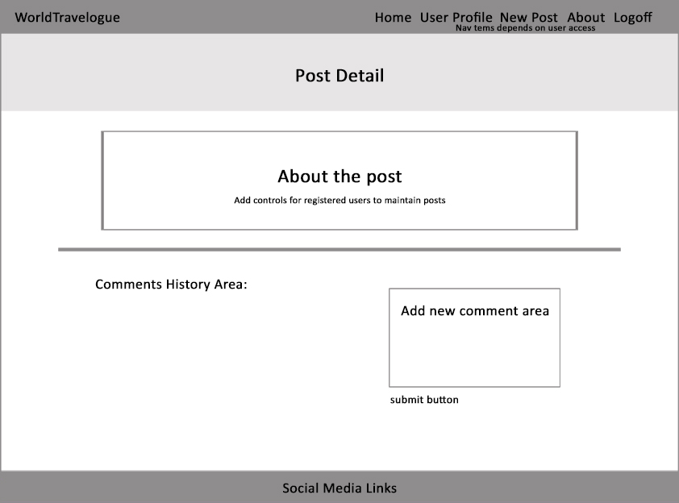
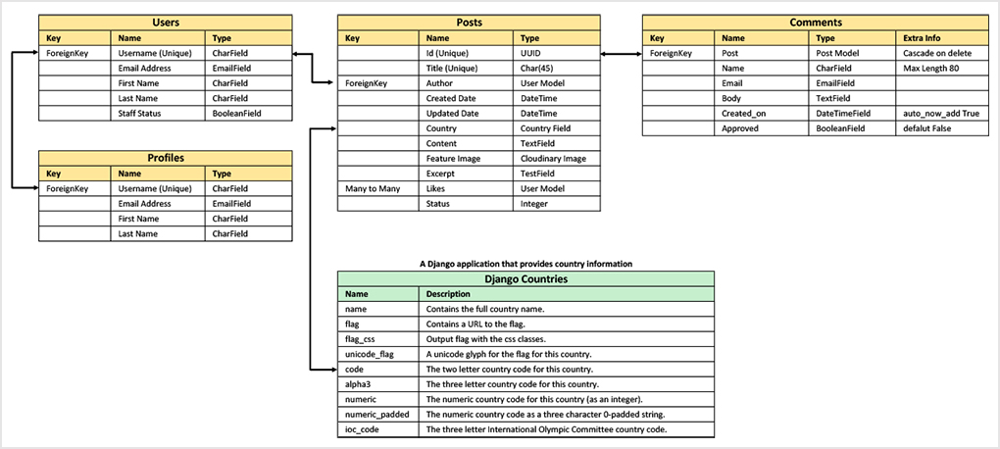
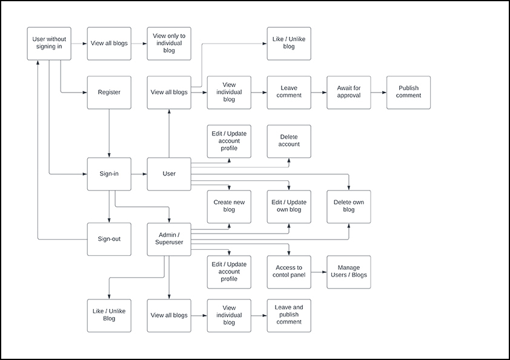

# WorldTravelogue
WorldTravelogue is a free online travel diary for travellers across the world. It works from internet cafes and computers worldwide, to allow you to update an online travel diary and share your experiences, it is free to join and takes just minutes to signup.
On this site the blogs are based on the theme in Travel and is a collection of tools so that travellers can write down a journal and share it to family, friends and other travellers. Photo and link to useful sites about the areas can be added to your blog. Also, comments can be added to the blog by other users so it can help out future travellers to the area.

Click [here](https://travelogue22kw.herokuapp.com/) to access live site.

*Screenshot - Mockup on WorldTravelogue App, generated from [Multi Device Website Mockup Generator](https://techsini.com/multi-mockup/index.php)*

---
## Table of Contents
* [Objectives](#objectives)
    * [Application Goal](#application-goals)
    * [User Goals](#user-goals)
* [Application Design](#application-design)
    * [Initial Design](#initial-design)
    * [Database Design](#database-design)
    * [Design Approach](#design-approach)
        * [User Stories](#user-stories)
        * [Kanban Board](#kanban-board)
    * [Process Map](#process-map)
* [Project Requirements](#project-requirements)
* [Features](#features)
    * [Frontend - Header and Footer](#frontend---header-and-footer)
        * [Header for and Footer Non-Registered users](#header-and-footer-for-non-registered-users)
        * [Header for and Footer Registered Users](#header-and-footer-for-registered-users)
        * [Header for and Footer Administrators](#header-and-footer-for-administrators)
        * [Header and Footer with Collapsed Menu Bar For Mobile Devices](#header-and-footer-with-collapsed-menu-bar-for-mobile-devices)
    * [Frontend - Home Page](#frontend---home-page)
        * [Posts list in Home Page](#posts-list-in-home-page)
        * [Users Access Rights to Posts](#users-access-rights-to-posts)
            * [Access rights for Non-Registered users](#access-rights-for-non-registered-users)
            * [Access rights for Registered users](#access-rights-for-non-registered-users)
            * [Access rights for Administrators](#access-rights-for-administrators)
        * [Responsive on Mobile Devices](#responsive-on-mobile-devices)
        * [Filter Posts](#filter-posts)
        * [Filter By Country](#filter-by-country)
        * [Filter By Author](#filter-by-author)
    * [Frontend - Create New Posts](#frontend---create-new-posts)
    * [Frontend - Post Detail](#frontend---post-detail)
        * [Users Access Rights to Post Detail](#users-access-rights-to-post-detail)
            * [Access Rights for Non-Registered Users](#access-rights-for-non-registered-users-1)
            * [Access Rights for Registered Users](#access-rights-for-registered-users-1)
            * [Access Rights for Owner's Post](#access-rights-for-owners-post)
    * [Frontend - Leave Comment to a Post](#frontend---leave-comment-to-a-post)
    * [Frontend - Like/Unlike Post](#frontend---likeunlike-post)
    * [Frontend - Edit Personal Post](#frontend---edit-personal-post)
    * [Frontend - Delete Personal Post](#frontend---delete-personal-post)
    * [Frontend - User Accounts](#frontend---user-accounts)
        * [Create an Account](#create-an-account)
        * [Sign in to an Account](#sign-in-to-an-account)
        * [Sign out from Account](#sign-out-from-account)
        * [View an Account Profile](#view-an-account-profile)
        * [Update an Account Profile](#update-an-account-profile)
        * [Change an Account Password](#change-an-account-password)
        * [Delete an Account](#delete-an-account)
    * [Frontend - About Page](#frontend---about-page)
    * [Frontend - Contact us Page](#frontend---contact-us-page)
    * [Frontend - Message Bar](#frontend---message-bar)
    * [Backend - Administrator Control Panel](#backend---administrator-control-panel)
        * [Blog Posts](#blog-posts)
        * [Blog Post Comments](#blog-post-comments)
        * [User Profiles](#user-profiles)
* [Future Features](#future-features)
* [Validator Testing](#validator-testing)
* [Testing](#testing)
* [Bugs](#bugs)
* [Deployment](#deployment)
    * [Development tools](#development-tools)
    * [Development processes](#development-processes)
    * [Steps for Setting up basic Django Project and Deploying to Heroku](#steps-for-setting-up-basic-django-project-and-deploying-to-heroku)
* [Tools](#tools)
* [Credits](#credits)
* [Acknowledgment](#acknowledgment)

---
## Objectives
The main objective of this site is to provide a platform for travellers to keep a journal online and share it with families and friends as well as other travellers.

The target audients will be travellers who wants to post their journal and people who want to contribute and find out more about the travel destinations.

### Application Goals
* Create a community to share travel experiences on destinations across the world.
* A platform that allows the users to create and update their travel journal instantly and share it with families and friends.
* A platform that allows users to get information about the travel destinations by reading other people's posts.
* Administrators to control and maintain users and posts.

### User Goals
* Any users can view posts on the site.
* Signup to create posts with photos and descriptions.
* Registered users can maintain their personal posts.
* Registered users can leave comments and like posts by other users.
* Registered users can update and maintain their own account profile.

*[Back to Contents](#table-of-contents)*

---
## Application Design

This application will be built using Bootstrap, Django and Cloudinary to store images. The final application will be deployed and running on Heroku.

### Initial Design

The following are initial wireframe designs to meet the main objective.

*Wireframe - Home Page*

*Wireframe - Example of a Home Page after signin*

*Wireframe - Post Detail Page*

### Database Design

### Design Approach

The development approach on this project is based on the Principles of Agile and use the common agile practices.

The design has broken down into User Stories and grouped into Epics. Each User Story has been allocated its priority, story point and set acceptance criteria and tasks. Timeboxing approach will be used to process the product backlog.

#### User Stories

There are 37 user stories identified at the beginning of the project and they were grouped into 7 Epics as listed in the table below.

**[User Stories Full Detailed Report (Click to view)](readme/user-stories/user-stories.md#user-stories)**

*Summary of Epics and User Stories*

#### Kanban Board

In development, Kanban Board was used to schedule the execution of the user stories. This approach allows to allocating user stories by priority and monitoring each user story's progress.

The Kanban board below shows all the user stories were initially in the 'To Do' list column. Then at different stage of the development, each one is moved into 'In Progress' column and finally into 'Done' column when it has completed. All user stories that are not included in this iteration are moved into 'Out of Current Scope' column.

### Process Map

The following is the process map for the site. The site can be accessed by non-registered users, registered users and administrators.

* Non-registered users have restricted access and only can view posts on the site.
* Registered users can create, read, update and delete posts. These users also have restricted access and only can manage their own posts.
* Administrators are users that have both access to the site and the control panel where they have full control to user profiles, posts and approve comments.

*Site Process Map*

*[Back to Contents](#table-of-contents)*

___

## Project Requirements

This project has been developed using Python Django, Bootstrap and Deployed in Heroku. The following are the project requirements in order to run the application.

* Django - a high-level Python web framework
* Gunicorn - a Web Server Gateway Interface (WSGI) to run Python web applications
* dj_databases_url - a simple Django utility allows you to utilize the 12factor inspired DATABASE_URL environment variable to configure your Django application.
* Psycopg2 - PostgreSQL database adapter for the Python programming language
* Cloudinary - Online platform to store images for this application
* dj3_cloudinary_storage - Django package that facilitates integration with Cloudinary by implementing Django Storage API.
* PostgreSQL - an open source object-relational database system
* Django summernote - is a simple WYSIWYG editor
* Django countries - an application that provides country choices for use with forms, flag icons static files, and a country field for models.
* Django crispy forms - an application that helps to manage Django forms.
* Django allauth - integrated set of Django applications addressing authentication, registration, account management as well as 3rd party (social) account authentication.
* Heroku - a platform as a service that enables developers to build, run, and operate applications entirely in the cloud.
* Bootstrap v5.0.2 - an open-source CSS framework directed at responsive, mobile-first front-end web development.

*[Back to Contents](#table-of-contents)*

___

## Features

The aim of this site is to create a community to share travel experiences and let other potential visitors to find more information about the destinations.

In order to meet the aim and allow the community to grow. There are no restrictions to visit the site but different access rights will be set to different user groups. The user groups have been defined into 3 different types for this site.

1. **Non-registered users**
    * Only allow to view posts and comments
    * Allow to register

2. **Registered users**
    * Allow to login
    * View posts, like or unlike and leave comment to other users’ posts
    * Create, Read, Update and Delete personal posts
    * View, update and delete personal account

3. **Administrators**
    * Allow to login
    * View posts, like or unlike and leave comment to other users’ posts
    * Create, Read, Update and Delete personal posts
    * View and update personal account
    * Access to control panel to perform site maintenance

This application has 2 separate sites:
* [Users site for general access - Frontend access](#frontend---header-and-footer)
* [Administrators site for maintenance - Backend access](#backend---administrator-control-panel)

### Frontend - Header and Footer

Users should be able to navigate and find information easily.

To help users to navigate and find information easily, all pages have a header with a navigation bar and a footer. The navigation bar items are depending on user access rights. Footer is where users can find the link to "Contact us" page and links to social media platform. Each social media link will be opened in a separate window.

All page footers are the same.

***[User Story #17 - As a Site User I can click the social media links so that I can only view the social media accounts that associated to this site](readme/user-stories/user-stories-17.jpg)***

#### Header and Footer for Non-Registered users

***[User Story #7 - As a Site User I can register to the site so that I can create an account to view, comment and like or unlike posts](readme/user-stories/user-stories-7.jpg)***

* Menu Items:

    * Home___About___Register___Login

#### Header and Footer for Registered Users

***[User Story #13 - As a Site User I can login to the site so that I can create, update and delete my posts with restriction](readme/user-stories/user-stories-13.jpg)***

* Menu Items:
    * Home___New Post___User Profile___About___Logout

#### Header and Footer for Administrators

***[User Story #14 - As a Site Admin I can login to the site so that I can create, update and delete my posts without restriction](readme/user-stories/user-stories-14.jpg)***

* Menu Items:
    * Home___New Post___User Profile___About___Control Panel___Logout

#### Header and Footer with Collapsed Menu Bar For Mobile Devices

### Frontend - Home Page

Users should able to view posts when they visiting this site.

When users visiting this site, they should be landed onto the home page. The home page is where all the published posts are listed and the site has set a maximum of 4 posts per page. Navigation buttons are available to select next and previous page when there are more than 4 posts.

#### Posts list in Home Page

***[User Story #21 As a Site User I can view the list of posts so that I can read the posts](readme/user-stories/user-stories-21.jpg)***

Each Post has the following layout:

* Feature image - either a default or uploaded by the user
* Author's username
* Country that the post is related
* Post Title
* A summary description about the post
* A "Read more" button
* Date and time stamp when the post was created
* Number of likes for the post

#### Users Access Rights to Posts

Different user groups have different access rights to the posts.

#### *Access rights for Non-Registered users*

***[User Story #7 - As a Site User I can register to the site so that I can create an account to view, comment and like or unlike posts](readme/user-stories/user-stories-7.jpg)***

* Allow to register as a site member by clicking the "Register" from the menu bar
* Read about the site by clicking the "About" from the menu bar
* View individual post by clicking the "Read More" button from a post
* Select posts to view from popular country by clicking the country from the side widget named "Popular Countries"
* Select posts to view from a country by clicking the Country from a post
* Select posts to view from an author by clicking the Author from a post

#### *Access rights for Registered users*

***[User Story #13 - As a Site User I can login to the site so that I can create, update and delete my posts with restriction](readme/user-stories/user-stories-13.jpg)***

* Allow to login to the site by clicking the "Login" from the menu bar
* Allow to create a new post by clicking the "New Post" from the menu bar
* Allow to view and update user profile by clicking the "User Profile" from the menu bar
* View individual post by clicking the "Read More" button from a post
* Select personal posts to view by clicking the username from the side widget named "My Posts"
* Select posts to view from popular country by clicking the country from the side widget named "Popular Countries"
* Select posts to view from a country by clicking the Country from a post
* Select posts to view from an author by clicking the Author from a post

#### *Access rights for Administrators*

***[User Story #14 - As a Site Admin I can login to the site so that I can create, update and delete my posts without restriction](readme/user-stories/user-stories-14.jpg)***

* Allow to login to the site by clicking the "Login" from the menu bar
* Allow to create a new post by clicking the "New Post" from the menu bar
* Allow to view and update user profile by clicking the "User Profile" from the menu bar
* Allow to access to the control panel by clicking the "Control Panel" from the menu bar
* View individual post by clicking the "Read More" button from a post
* Select personal posts to view by clicking the username from the side widget named "My Posts"
* Select posts to view from popular country by clicking the country from the side widget named "Popular Countries"
* Select posts to view from a country by clicking the Country from a post
* Select posts to view from an author by clicking the Author from a post

#### Responsive on Mobile Devices

For mobile devices, 1 post per row and side widgets are re-arranged below the posts.

#### Filter Posts

Users should be able to view posts that is more relevant to them.

This site can narrow down the posts by offering filters to the users by Country or Author.

#### Filter By Country

***[User Story #22 - As a Site User I can select a popular country so that I can only read posts from selected country](readme/user-stories/user-stories-22.jpg)***

Select a country from the side widget for "Popular Countries" or the country from a post. All the posts related to the selected country will return as a new list. A message will say "No Posts Found!" when there are no posts for the selected country and the side widget shows the current filter is set to the selected country. Select "All" to clear the current filter.

#### Filter By Author

***[User Story #29 - As a Registered Site User I can filter the posts so that I can only see my posts](readme/user-stories/user-stories-29.jpg)***

***[User Story #30 - As a Site User I can filter the posts by author so that I can follow the author posts](readme/user-stories/user-stories-30.jpg)***

Select your own posts from the side widget for "My Posts" or an author from a post. All the posts related to the selected author will return as a new list. A message will say "No Posts Found!" when there are no posts for the selected author and the side widget shows the current filter is set to the selected author. Select "All" to clear the current filter.

### Frontend - Create New Posts

***[User Story #24 - As a Registered Site User I can submit a new post so that my post can be viewed by other users](readme/user-stories/user-stories-24.jpg)***

Registered users should allow to create new personal posts.

When a user signed in to the site then a new post can be created by clicking "New Post" from the menu bar.

Create a New Post form is presented to the user and all the mandatory fields need to be filled in before it can be submitted.

**Create a New Post Form**

### Frontend - Post Detail

***[User Story #21 - As a Site User I can view the list of posts so that I can read the posts](readme/user-stories/user-stories-21.jpg)***

Users should able to access the detail of each post.

All users can view post in details and read comments that associated with the post. Registered users can leave comments and like/unlike posts.

Each Detail Post has the following layout:

* Inside the Banner
    * Post Title
    * Author's username | Date and time stamp when the post was created
    * Country that the post is related
* Detail Section
    * Feature image - either a default or uploaded by the user
    * Edit and Delete buttons (Post's Owner Only)
    * A summary description about the post
    * A detail description about the post
    * Number of likes for the post
    * Number of comments for the post
* Comments Section
    * A list of comments from most recent first with Author and Date stamp
    * Leave a comment form with a Submit button (Registered Users Only)

#### Users Access Rights to Post Detail

Different user groups have different access rights to the post detail.

#### *Access Rights for Non-Registered Users*

***[User Story #7 - As a Site User I can register to the site so that I can create an account to view, comment and like or unlike posts](readme/user-stories/user-stories-7.jpg)***

* View post details only
* View comments only

#### *Access Rights for Registered Users*

***[User Story #25 - As a Registered Site User I can click on a post to leave comments so that I can join the conservation about the post](readme/user-stories/user-stories-25.jpg)***

***[User Story #26 - As a Registered Site User I can click on a post so that I can like or unlike the post](readme/user-stories/user-stories-26.jpg)***

* View post details
* Leave comment to any post
* Like/Unlike any post

#### *Access Rights for Owner's Post*

***[User Story #13 - As a Site User I can login to the site so that I can create, update and delete my posts with restriction](readme/user-stories/user-stories-13.jpg)***

* View post details
* Leave comment to any post
* Like/Unlike any post
* Edit and update personal posts
* Delete personal posts

### Frontend - Leave Comment to a Post

***[User Story #25 - As a Registered Site User I can click on a post to leave comments so that I can join the conservation about the post](readme/user-stories/user-stories-25.jpg)***

Registered users should able to comment any posts

A form is available in the detail post where registered users can fill in and submit the form. The comment counter goes up by 1 when a comment has submitted successfully.

**Example of leaving a comment**

In this example, the author submitted a comment "Very tasty" and it appears on the left and the system ask whether the user wish to leave another comment. Select the "Add Another Comment" takes the user back the comment form and select "Go Back" takes the user back to the home page.

### Frontend - Like/Unlike Post

***[User Story #26 - As a Registered Site User I can click on a post so that I can like or unlike the post](readme/user-stories/user-stories-26.jpg)***

Registered users should able to like/unlike any posts

The option to like or unlike a post is available in the detail post and it is in a form of a "Heart" shape.

* It should be grey out for non-registered users
* Click to toggle between like or unlike post
    * Red outline heart shape means the current user has not liked the post yet
    * Solid heart shape means current user liked the post
    * Likes counter goes up or down by 1 when toggle between like and unlike post

### Frontend - Edit Personal Post

***[User Story #27 - As a Registered Site User I can select one of my post so that I can edit and update my post](readme/user-stories/user-stories-27.jpg)***

Registered users should able to edit and update personal posts

When the registered user signed in to the site and select a personal post then the post can be updated by submitting the form.

**A Form to Edit and Update Post**

### Frontend - Delete Personal Post

***[User Story #28 - As a Registered Site User I can select one of my post so that I can delete my post from the list](readme/user-stories/user-stories-28.jpg)***

Registered users should able to delete personal posts

When the registered user signed in to the site and select a personal post then the post can be deleted.

**Confirmation Message to Delete a Post**

### Frontend - User Accounts

Users should be able to create, read, update and delete their own account profile.

The site allows viewers to create an account. After signed in to the account, the owner can view, update and delete their account profile.

#### Create an Account

***[User Story #7 - As a Site User I can register to the site so that I can create an account to view, comment and like or unlike posts](readme/user-stories/user-stories-7.jpg)***

Select Register from the menu bar, fill and submit the form.

#### Sign in to an Account

***[User Story #13 - As a Site User I can login to the site so that I can create, update and delete my posts with restriction](readme/user-stories/user-stories-13.jpg)***

Select Login from the menu bar,  fill and submit user details

#### Sign out from Account

***[User Story #15 - As a Site User/Admin I can logout the site so that I can protect my posts](readme/user-stories/user-stories-15.jpg)***

Select Logout from the menu bar and confirm sign out.

#### View an Account Profile

***[User Story #8 - As a Site User I can view my own profile so that I can check details on my profile are correct](readme/user-stories/user-stories-8.jpg)***

Login and select User Profile from the menu bar

#### Update an Account Profile

***[User Story #9 - As a Site User I can edit my own profile so that I can update details on my profile](readme/user-stories/user-stories-9.jpg)***

Login and select User Profile from the menu bar

Edit and select Update to update profile

#### Change an Account Password

***[User Story #11 - As a Site User I can change my password so that I can secure my account](readme/user-stories/user-stories-11.jpg)***

Login and select User Profile from the menu bar

Select Change Password

Fill details and submit changes

#### Delete an Account

***[User Story #10 - As a Site User I can delete my account so that I can leave the site permanently](readme/user-stories/user-stories-10.jpg)***

Login and select User Profile from the menu bar

Select Delete and confirm delete account

### Frontend - About Page

***[User Story #16 - As a Site User I can navigate to about page so that I can only read about the purpose of this site](readme/user-stories/user-stories-16.jpg)***

Users should able to find more information about the site.

The About page offer information about the site and the user can access it by selecting "About" from the menu bar.

### Frontend - Contact us Page

***[User Story #18 - As a Site User I can navigate to contact page so that I can get the contact details for this site](readme/user-stories/user-stories-18.jpg)***

Users should able to contact the site support team.

The Contact us page contains information for user to contact the support team and can be access by selecting "Contact us" in the footer.

### Frontend - Message Bar

Users should be able to confirm actions have been performed.

On this site, a message bar has been created to confirm action has been performed. Message only appears for 3 seconds when the action has been performed. Examples are Login and Logout successfully, Post and Comment added successfully.

**Message shows signed in as admin**

### Backend - Administrator Control Panel

***[User Story #32 - As a Site Admin I can login to admin page so that I can manage users access](readme/user-stories/user-stories-32.jpg)***

Site administrators need a facility to maintain users, posts and comments.

Django administration allows to extend the basic features in the control panel. This has been modified to offer extra functionalities to maintain the blog posts and comment.

Site superuser account need to be created in order to access to the control panel via the site or URL link by adding "/admin" to the home page url.

**Control Panel - Login Page**

***[User Story #14 - As a Site Admin I can login to the site so that I can create, update and delete my posts without restriction](readme/user-stories/user-stories-14.jpg)***

**Control Panel - Home Page**

#### Blog Posts

***[User Story #33 - As a Site Admin I can login to admin page so that I can create, read, update and delete posts](readme/user-stories/user-stories-33.jpg)***

***[User Story #34 - As a Site Admin I can create a new post so that the post can be viewed](readme/user-stories/user-stories-34.jpg)***

***[User Story #35 - As a Site Admin I can disapprove new posts so that I can safeguard users from harmful contents](readme/user-stories/user-stories-35.jpg)***

This is the section to maintain the posts in the blog application. The standard features in this section allows to Create, Read, Update and Delete posts.

Following are customised features:
* List Display
    * Display Fields: Title, Country, Status and Created On
* Search Bar
    * Search fields: Title, Country and Content
* Filters
    * By Status
    * By Created On
* Action in Bulk
    * Delete selected posts
    * Publish posts
    * Disapprove posts

#### Blog Post Comments

***[User Story #36 - As a Site Admin I can login to admin page so that I can manage comments](readme/user-stories/user-stories-36.jpg)***

***[User Story #37 - As a Site Admin I can approve or disapprove comments so that I can decide which comment can be published](readme/user-stories/user-stories-37.jpg)***

This is the section to maintain the comments in the blog application. The standard features in this section allows to Create, Read, Update and Delete comments.

Following are customised features:
* List Display
    * Display Fields: Name, Body, Post, Created On and Approved
* Search Bar
    * Search fields: Name, email and body
* Filters
    * By Approved
    * By Created On
* Action in Bulk
    * Delete selected comments
    * Approve Comments
    * Disapprove Comments

#### User Profiles

This is the section to maintain the user profiles in the travelogue project. For this initial phase the profiles are only extension of the users from the Authentication and Authorization section. Additional features can be added to the profiles in future development.

*[Back to Contents](#table-of-contents)*

___
## Future Features

Five user stories were decided not to be included at the initial phase of the project. These can be implemented in the next milestone.

The user stories are:

* [User Story #12 - Reset Password](readme/user-stories/user-stories-12.jpg)
    * User able to reset forgotten password
* [User Story #23 - Filter by Country](readme/user-stories/user-stories-23.jpg)
    * User able to filter posts from list of all countries
* [User Story #31 - Sort Posts](readme/user-stories/user-stories-31.jpg)
    * User able to sort posts by fields such as date and country
* [User Story #19 - Contact Form](readme/user-stories/user-stories-19.jpg)
    * Provide users a contact form
* [User Story #20 - Response to Request](readme/user-stories/user-stories-20.jpg)
    * Initial response to contact form automatically by email

As mentioned in the features section that current User Profiles is only an extension of users from Django table. The intention of the user profiles is to provide additional future features such as user’s photo or avatar, social media accounts and date joined as a member.

The site can greatly improve by allowing multiple images to upload and display in a post.

Another feature is to create an image gallery so viewer can view all images by an author or a country.

*[Back to Contents](#table-of-contents)*

___
## Validator Testing

Validator testing is used to validate codes that are legally written and to identify any possible errors. This can be done by using online automated testing tools to scan through the codes. The tools used for this project are

W3C Markup Validation Service to validate HTML - https://validator.w3.org/
W3C CSS Validation Service to validate CSS - https://jigsaw.w3.org/css-validator/

The source code can be copied and paste directly into the validator to perform the test. A report will be generated with the test results where it identified the errors. The validator will show passed when the code is free of error.

### Validation Reports

**HTML Validation Reports**

20 pages of html were tested and no error was found. Each test report can be viewed by clicking one of the links below.

* [Home Page without Signing In](readme/testing/w3c-validations/01-home-page.png)
* [About Page](readme/testing/w3c-validations/02-about-page.png)
* [Sign Up Page](readme/testing/w3c-validations/03-sign-up.png)
* [Sign In Page](readme/testing/w3c-validations/04-sign-in.png)
* [Contact us Page](readme/testing/w3c-validations/05-contact-us-page.png)
* [Post's Detail Page without Signing In](readme/testing/w3c-validations/06-post-detail.png)
* [Posts Filtered By Country](readme/testing/w3c-validations/07-filter-by-country.png)
* [Posts Filtered By Authors](readme/testing/w3c-validations/08-filter-by-author.png)
* [Home Page - Signed In](readme/testing/w3c-validations/09-home-signed-in.png)
* [Create New Post](readme/testing/w3c-validations/10-new-post.png)
* [View/Edit User Profile](readme/testing/w3c-validations/11-user-profile.png)
* [Change User Password](readme/testing/w3c-validations/12-change-password.png)
* [Delete User Account](readme/testing/w3c-validations/13-delete-account.png)
* [Post's Detail - Signed In](readme/testing/w3c-validations/14-post-detail-signed-in.png)
* [Post's Detail with Add Another Comment](readme/testing/w3c-validations/15-post-detail-additional-comment.png)
* [Owner's Detail Post](readme/testing/w3c-validations/16-owner-post-detail.png)
* [Edit Owner Post](readme/testing/w3c-validations/17-edit-owner-post.png)
* [Delete Owner Post](readme/testing/w3c-validations/18-delete-owner-post.png)
* [Sign Out Page](readme/testing/w3c-validations/19-sign-out.png)
* [Home Page for Administrator](readme/testing/w3c-validations/20-home-admin.png)

**CSS Validation Report**

The customised CSS file was tested and no error was found.

*[Back to Contents](#table-of-contents)*

___
## Testing

For this project, tests have been carried out using both Django Unit Tests and Manual Tests.

**Django Unit Tests**

These are automated tests by executing test scripts from the terminal. In this project, only URLs have been tested in this method.

There are 10 URLs tests and they all passed the test.

* Test 'home' url
* Test 'popular country' url
* Test 'posts by author' url
* Test 'detail post' url
* Test 'like/unlike' url
* Test 'create new post' url
* Test 'edit/update post' url
* Test 'delete post' url
* Test 'about' page url
* Test 'contact us' page url

*Test Results*

**Manual Testing**

Functional testing on this project has been carried out by executing the test scripts as defined below in the test report.

**[Manual Tests Report (Click to view)](readme/testing/testing.md#manual-testing-for-travelogue22kw-project)**

*[Back to Contents](#table-of-contents)*

___
## Bugs

During testing, it was noticed that there is an 'Uncaught TypeError' showing in the console log. The error shown below indicates there is a problem with bootstrap. This error seems to be resolved by correcting the version of bootstrap. Further monitoring is recommended to confirm this bug has been fixed throughout the site.

*[Back to Contents](#table-of-contents)*

___
## Deployment

This is a Django project and deployed in Heroku.

At the beginning of the project, a simple skeleton Django project was deployed to Heroku to ensure the project is connected and running successfully in Heroku.

The final version of code at each phase of the project is then needs to deploy to Heroku so the site is running the latest version of the project.

The deployed app can be found [here](https://travelogue22kw.herokuapp.com/).

### Development tools
* GitHub is a code hosting platform for version control and collaboration
* Gitpod is a ready-to-code developer environment
* Heroku for building, deploying, and managing apps

### Development processes

* All the development works are carried out in Gitpod
* Create a repository in Github through Gitpod
* Start the project from a template written by Code Institute. The full template can be copied from [here](https://github.com/Code-Institute-Org/gitpod-full-template)

    **Repeat the following until project completion**

* Developing your site, save your project in your Gitpod workspaces
* Use git add command to add files to local repository
* Use git commit command to commit the changes to local repository
* Use git push to upload local repository content (Gitpod) to a remote repository (Github)
* The latest code pushed to Github then can be deployed to Heroku

***You can use GitHub Desktop to clone and fork repositories that exist on GitHub.***

Click [here](https://docs.github.com/en/desktop/contributing-and-collaborating-using-github-desktop/adding-and-cloning-repositories/cloning-and-forking-repositories-from-github-desktop) for more information on Cloning and forking repositories from GitHub Desktop.

### Steps for Setting up basic Django Project and Deploying to Heroku

The following are the steps to setting up Django project and deploying to Heroku.

*[Back to Contents](#table-of-contents)*

___
## Tools
The tools used to carry out the development and deployment on this project are:
* Gitpod and Github
* Python modules
* Django and libraries
* Cloudinary
* Chrome Dev Tools
* Webpage Screenshots - Chrome app extension (FireShot)
* [Lucid Chart](https://www.lucidchart.com/) for creating flow chart
* [PEP8 online checker](http://pep8online.com/) for code validation
* [Heroku](https://id.heroku.com/login) for building, deploying, and managing apps
* [Pixerbay](https://pixabay.com/) for images

*[Back to Contents](#table-of-contents)*

___
## Credits

* [Template](https://github.com/Code-Institute-Org/gitpod-full-template) created by [Code Institute](https://codeinstitute.net/)
* [W3Schools](https://www.w3schools.com/python/default.asp) for research, examples and techniques in Python programming
* [Bootstrap](https://getbootstrap.com)
* [Bootstrap Templates](https://startbootstrap.com)
* [Django Documentation](https://docs.djangoproject.com/en/4.0/)
* [Django Testing Tutorial - Youtube By The Dumbfounds](https://www.youtube.com/watch?v=qwypH3YvMKc&list=PLbpAWbHbi5rMF2j5n6imm0enrSD9eQUaM&index=1)
* [Django Filter And Pagination - Youtube by TauhidCodes](https://www.youtube.com/watch?v=dkJ3uqkdCcY&t=1138s)
* Code Institute Full Stack Framework tutorials

*[Back to Contents](#table-of-contents)*

___
## Acknowledgment

I would like to thank the following to support the development of this site.

* Learning Support - Code Institute
* Mentoring Support - Daisy McGirr