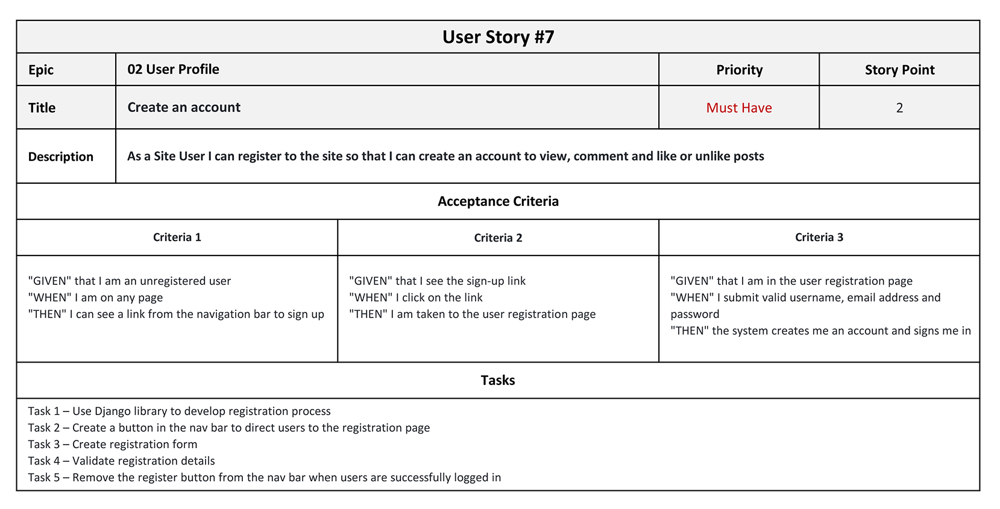

# User Stories

This document list the details of each User Story for the World Travelogue project. There are total of 37 User Stories.

Epic 01 Django Project - Initial Setup and Deployment

1. [Install Django and supporting libraries](#user-story-1)
2. [Create a new blank Django project and apps](#user-story-2)
3. [Set project to use Cloudinary and PostgreSQL in Heroku](#user-story-3)
4. [Deploy new project to Heroku early for development](#user-story-4)
5. [Create project database models](#user-story-5)
6. [Deploy final project to Heroku](#user-story-6)

Epic 02 User Profile

7. [Create an account](#user-story-7)
8. [View own account](#user-story-8)
9. [Edit own account](#user-story-9)
10. [Delete own account](#user-story-10)
11. [Change password](#user-story-11)

Epic 03 Login and Logout

12. [Reset password](#user-story-12)
13. [User owner login](#user-story-13)
14. [Administrator login](#user-story-14)
15. [Account logout](#user-story-15)

Epic 04 Site Navigation

16. [About page](#user-story-16)
17. [Social Media Pages](#user-story-17)
18. [Contact Us page](#user-story-18)

Epic 05 User Request/Enquiry

19. [Contact Form](#user-story-19)
20. [Response to request](#user-story-20)

Epic 06 Blog Posts

21. [View posts](#user-story-21)
22. [Posts from popular countries](#user-story-22)
23. [Filter by country](#user-story-23)
24. [Add a new post](#user-story-24)
25. [Comment on a post](#user-story-25)
26. [Like or unlike a post](#user-story-26)
27. [Edit my post](#user-story-27)
28. [Delete my post](#user-story-28)
29. [Filter my posts](#user-story-29)
30. [Filter posts by author](#user-story-30)
31. [Sort posts](#user-story-31)

Epic 07 Site Control Panel

32. [Manage Site](#user-story-32)
33. [Manage posts](#user-story-33)
34. [Add a new post](#user-story-34)
35. [Disapprove posts](#user-story-35)
36. [Manage Comments](#user-story-36)
37. [Disapprove comments](#user-story-37)

### User Story #1

Return to [Top](#user-stories) of the page or main document [README](/README.md#design-approach)

### User Story #2

Return to [Top](#user-stories) of the page or main document [README](/README.md#design-approach)

### User Story #3

Return to [Top](#user-stories) of the page or main document [README](/README.md#design-approach)

### User Story #4

Return to [Top](#user-stories) of the page or main document [README](/README.md#design-approach)

### User Story #5

Return to [Top](#user-stories) of the page or main document [README](/README.md#design-approach)

### User Story #6

Return to [Top](#user-stories) of the page or main document [README](/README.md#design-approach)

### User Story #7

Return to [Top](#user-stories) of the page or main document [README](/README.md#design-approach)

### User Story #8

Return to [Top](#user-stories) of the page or main document [README](/README.md#design-approach)

### User Story #9

Return to [Top](#user-stories) of the page or main document [README](/README.md#design-approach)

### User Story #10

Return to [Top](#user-stories) of the page or main document [README](/README.md#design-approach)

### User Story #11

Return to [Top](#user-stories) of the page or main document [README](/README.md#design-approach)

### User Story #12

Return to [Top](#user-stories) of the page or main document [README](/README.md#design-approach)

### User Story #13

Return to [Top](#user-stories) of the page or main document [README](/README.md#design-approach)

### User Story #14

Return to [Top](#user-stories) of the page or main document [README](/README.md#design-approach)

### User Story #15

Return to [Top](#user-stories) of the page or main document [README](/README.md#design-approach)

### User Story #16

Return to [Top](#user-stories) of the page or main document [README](/README.md#design-approach)

### User Story #17

Return to [Top](#user-stories) of the page or main document [README](/README.md#design-approach)

### User Story #18

Return to [Top](#user-stories) of the page or main document [README](/README.md#design-approach)

### User Story #19

Return to [Top](#user-stories) of the page or main document [README](/README.md#design-approach)

### User Story #20

Return to [Top](#user-stories) of the page or main document [README](/README.md#design-approach)

### User Story #21

Return to [Top](#user-stories) of the page or main document [README](/README.md#design-approach)

### User Story #22

Return to [Top](#user-stories) of the page or main document [README](/README.md#design-approach)

### User Story #23

Return to [Top](#user-stories) of the page or main document [README](/README.md#design-approach)

### User Story #24

Return to [Top](#user-stories) of the page or main document [README](/README.md#design-approach)

### User Story #25

Return to [Top](#user-stories) of the page or main document [README](/README.md#design-approach)

### User Story #26

Return to [Top](#user-stories) of the page or main document [README](/README.md#design-approach)

### User Story #27

Return to [Top](#user-stories) of the page or main document [README](/README.md#design-approach)

### User Story #28

Return to [Top](#user-stories) of the page or main document [README](/README.md#design-approach)

### User Story #29

Return to [Top](#user-stories) of the page or main document [README](/README.md#design-approach)

### User Story #30

Return to [Top](#user-stories) of the page or main document [README](/README.md#design-approach)

### User Story #31

Return to [Top](#user-stories) of the page or main document [README](/README.md#design-approach)

### User Story #32

Return to [Top](#user-stories) of the page or main document [README](/README.md#design-approach)

### User Story #33

Return to [Top](#user-stories) of the page or main document [README](/README.md#design-approach)

### User Story #34

Return to [Top](#user-stories) of the page or main document [README](/README.md#design-approach)

### User Story #35

Return to [Top](#user-stories) of the page or main document [README](/README.md#design-approach)

### User Story #36

Return to [Top](#user-stories) of the page or main document [README](/README.md#design-approach)

### User Story #37

Return to [Top](#user-stories) of the page or main document [README](/README.md#design-approach)
